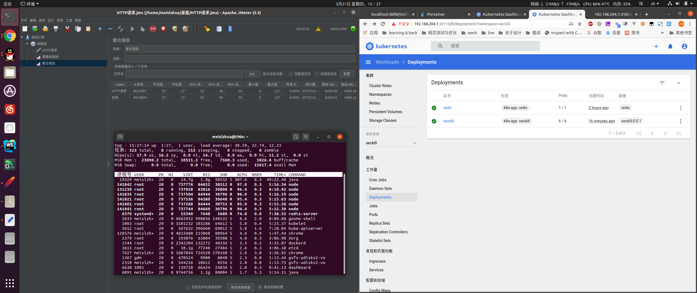
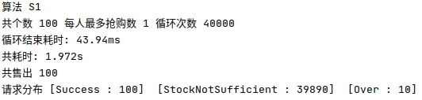
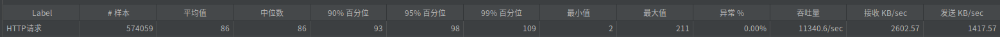
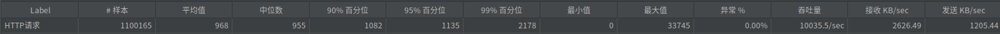
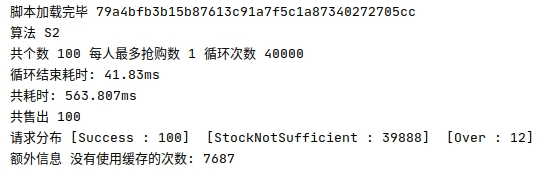
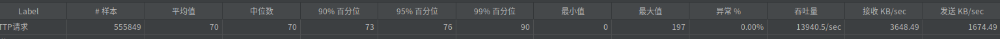
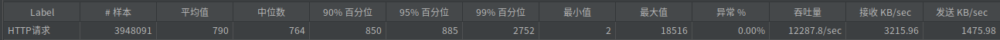
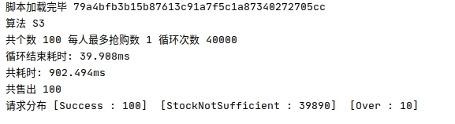
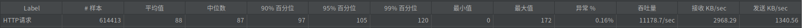
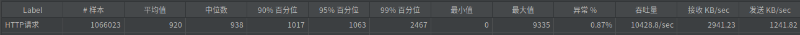

# 秒杀算法的几种实现方法

## 前言

本文的基于`node.js`实现,采用`Typescript`语言(有其他语言基础的基本也能理解)

## 机器配置
*   类型: 笔记本(散热不会太好会降频) 
*   CPU: Intel® Core™ i7-8750H (6核12线程 睿频3.9GHz)
*   内存: 24G 2400MHz
*   网络: 本机内网!
 

## 算法一 基于redis直接缓存数据,直接读取测试

### 基本步骤[(源码)](https://github.com/meislzhua/seckill/blob/master/src/solution/S1.ts)
//todo 时序图
1.  获取秒杀基本信息和已经出售的量
2.  判断时间和是否售罄,再判断自身的购买数量 等秒杀限制信息
3.  执行出售量累加操作,并记录用户抢购数
4.  判断累加数和用户抢购数是否正常,若不正常,则回滚操作
5.  写入消息队列,异步写入数据库(针对可能多个抢购的操作,若并发量不大,亦可直接写入数据库)
6.  返回抢购信息

### 特点
*   纯语言独立逻辑实现,复杂度低
*   多次与redis进行交互,性能表现没那么好
*   如果同一个用户同时并发,则会造成暂时获取"秒杀资源"还没释放时,其他用户显示"已秒杀完";
*   如果采用读写分离,可能会因为同步延迟的原因,重复获取并取消,造成额外的性能消耗

### 性能表现

#### 自行编写的测试程序

#### 单进程 jmeter1000并发

#### 单进程 jmeter10000并发

## 算法二 基于本地缓存的优化方式测试

### 基本步骤[(源码)](https://github.com/meislzhua/seckill/blob/master/src/solution/S2.ts)
这个其实更多的算是一种思想,而不是一种实现方式  
所以可以混合其他实现方式,一起实现  
但是和不同的算法混合,缓存算法也需要根据情况作出修改  
这里结合了算法3一起进行实现

### 特点
*   需要缓存管理模块,复杂度高(管理算法需要根据是情况而定)(限制大,复杂意味着容易出错)
*   如果秒杀项目数量大,则需要必须作访问控制,按照规则分发到不同的服务器
*   额外消耗了内存,但是能较好的提升性能

#### 性能表现
#### 自行编写的测试脚本

#### 单进程 jmeter1000并发

#### 单进程 jmeter10000并发

### 算法3 基于redis直接执行脚本的方式测试

### 基本步骤[(源码)](https://github.com/meislzhua/seckill/blob/master/src/solution/S3.ts)
1.  秒杀基本信息,判断部分不可用的情况:时间,剩余数量(可选)
2.  执行储存预先写好lua脚本
    1.  判断售出情况,是否适宜售出
    2.  出售量增加
    3.  返回相应信息
3.  直接读取脚本,并返回信息

### 特点
*   使用lua脚本,增加了奇怪的耦合
*   由脚本执行操作,可以节省其他需要保证原子性的操作的消耗
*   脚本使部分应用逻辑和性能消耗转移到了redis服务器
*   与reids交互只需进行少量交互
*   增加第一步,可以使redis读写分离成为可能

#### 性能表现

#### 自行编写的测试脚本

#### 单进程 jmeter1000并发

#### 单进程 jmeter10000并发

###你可能有些疑问

#### 为什么你只测试单进程而不测试多进程了?
其实基于PM2和K8S的多进程都测试过,并发量和响应时间都比较好的呈现正相关关系,但是并没有放出来.因为是笔记本,所以散热能力有限,本来跑个jmeter压力已经够大了,还要跑满几个node进程,笔记本开强冷风扇满速也没办法冷却下来,全程90+度,大概率已经在降频,这样参考价值就不大了.而且多进程虽然有一定的损耗,但也可以根据单进程进行大概推断,所以多线程这里就暂时不放出来了

#### 我想进行自己测试,我该怎么做?
首先执行克隆[整个项目](https://github.com/meislzhua/seckill) ,然后安装依赖  
部署好redis,在`src/config.ts`里面修改好地质  
修改`src/index.ts`里面的算法方式,可选`S1`,`S2`,`S3`  
执行`npm run build`,编译好之后,在目录找到`./out/src/index.js`直接执行即可  
web在`./out/src/web.js`

#### 感觉这些算法有点少呀,感觉应该还有更多呀?
分布式锁和异步请求处理,前者实在没必要,后者虽然可能会暂时提高吞吐率,但是也会增加资源的消耗量  
目前编写的算法都是基于缓存的,如果只是单纯换成其他缓存的话,必要性不大  
直接基于数据库,这种方式吞吐率实在有限,而且我本来研究秒杀问题其实本质就是如果处理大量并发的情况,
本来数据库就应该避免大量并发,强行使用从库来提高读取并发量的话,为何不直接使用缓存呢,更加直接有效得多  

如果有更加好的做法,可以在评论区指出或直接提出[issue](https://github.com/meislzhua/seckill/issues)

#### 项目地址
[https://github.com/meislzhua/seckill](https://github.com/meislzhua/seckill)

你的支持,就是我的动力!觉得对你有帮助的话,可以点个赞~或者在项目内点个star  

### 后语

